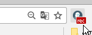
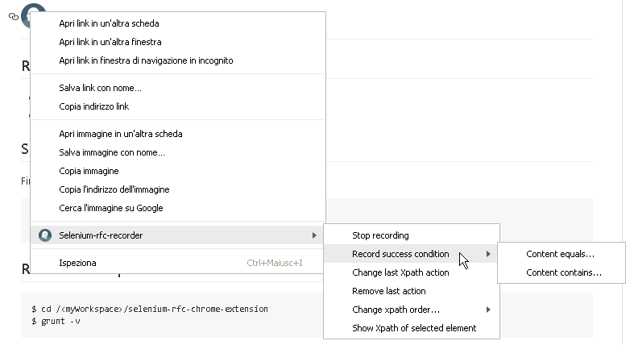

#  Selenium-rfc-recorder

Record a whole navigation flow with success condition, export a JSON script that you can re-run with [Selenium Run From Configuration Client](https://github.com/bitmarte/selenium-rfc-client).

## Requirements
 - node v4.4.3
 - npm v2.15.1

## Setup
First of all, clone this repo into your workspace directory. 

    $ cd /<myWorkspace>/selenium-rfc-chrome-extension
	$ npm install

## Run & Develop

	$ cd /<myWorkspace>/selenium-rfc-chrome-extension
	$ grunt -v

 - Go to Chrome extensions tab (chrome://extensions/)
 - Check on "develop mode"
 - Load an unpacked extensions pointing your dist dir (/<myWorkspace>/selenium-rfc-chrome-extension/dist)
 - Reload whenever is necessary during your development

**Notes**
*'replace'* task will not execute on watch!

## Dist

Generate a dist release, ready for your Google Chrome browser

 	$ cd /<myWorkspace>/selenium-rfc-chrome-extension
	$ grunt -v dist

### Upload an unpacked version

 - Go to Chrome extensions tab (chrome://extensions/)
 - Check on "develop mode"
 - Load an unpacked extensions pointing your dist dir (/<myWorkspace>/selenium-rfc-chrome-extension/dist)